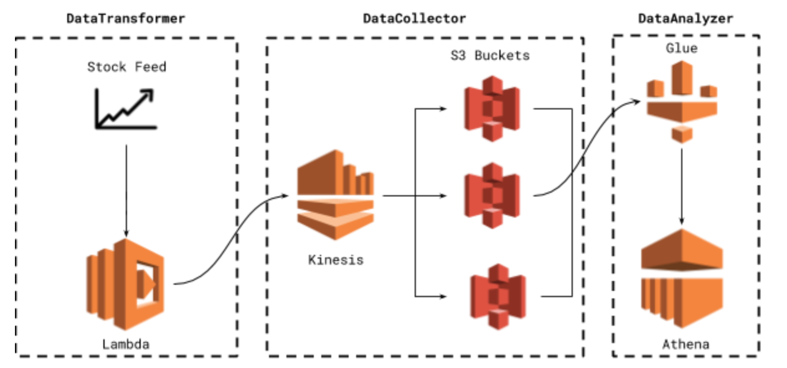
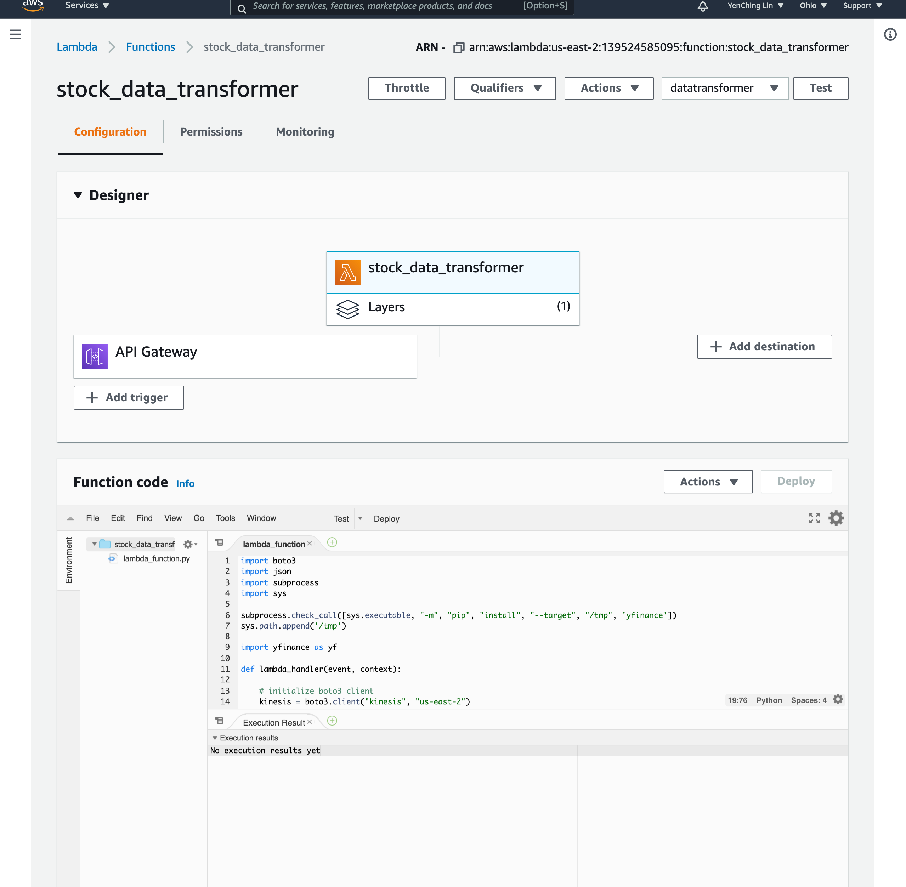
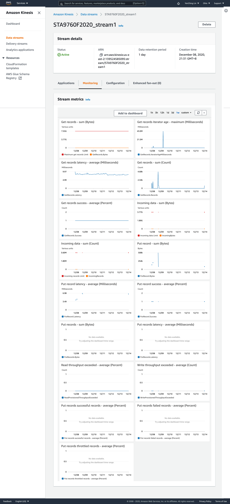
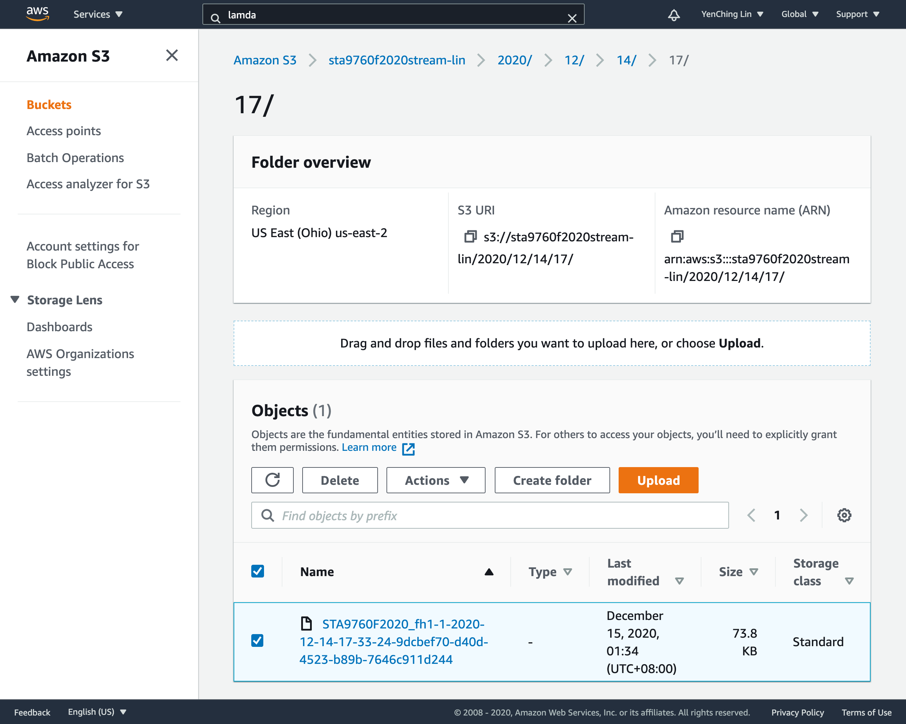

# Streaming Finance Data with AWS Lambda

											Yen-Ching, Lin

This project leads us through the process of consuming “real time” data, processing the data and then dumping it in a manner that facilitates querying and further analysis, either in real time or near real time capacity.

The entire framework for this project are shown in the figure below:

There are three major infrastructure elements that work in tandem: 

1. A lambda function that gathers our data (DataTransformer)
2. A Kinesis stream that holds our data (DataCollector)
3. A serverless process that allows us to query our S3 data (DataAnalyzer)

We will equip the following tools to achieve our goal:

***AWS*** : Lambda, Kinesis, Glue, Athena

***Python module*** : yfinance

## Data Transformer
The **Lambda function** below

* [Lambda Trigger](https://3qi2imwgfa.execute-api.us-east-2.amazonaws.com/default/stock_data_transformer "Lambda")



will collect the following stock data on Dec 1st, 2020:

* Facebook (FB)
* Shopify (SHOP)
* Beyond Meat (BYND)
* Netflix (NFLX)
* Pinterest (PINS)
* Square (SQ)
* The Trade Desk (TTD)
* Okta (OKTA)
* Snap (SNAP)
* Datadog (DDOG)

## Data Collector

After grabing stock price data and place it into the **Kinesis delivery stream**, I then configure **AWS Glue** and point it to the S3 Bucket that we created in DataCollector.

#### Kinesis Data Firehose Delivery Stream Monitoring


#### S3 Data Bucket


## Data Analyzer
After setting up a Glue crawler, we can finally run **AWS Athena** queries against our stock price data. Running the query below in Athena gives us the highest hourly stock “high” per company from the stock list.

```
SELECT t1.name, t1.hours, ROUND(t1.highest, 2) AS highest, t2.ts
FROM (SELECT name, SUBSTR(ts, 12, 2) AS hours, MAX(high) AS highest
      FROM "17"
      WHERE high > 0
      GROUP BY 1, 2) t1
      JOIN (SELECT name, ts, SUBSTR(ts, 12, 2) AS hours, high
            FROM "17") t2
            ON t1.name = t2.name
            AND t1.hours = t2.hours
            AND t1.highest = t2.high
            ORDER BY t1.name, t1.hours;
```
The complete query results is in "***results.csv*** " file. For further analysis to this data, please see the "***Analysis.pdf*** ".
 
